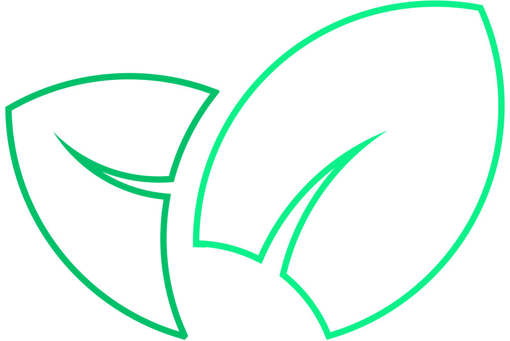
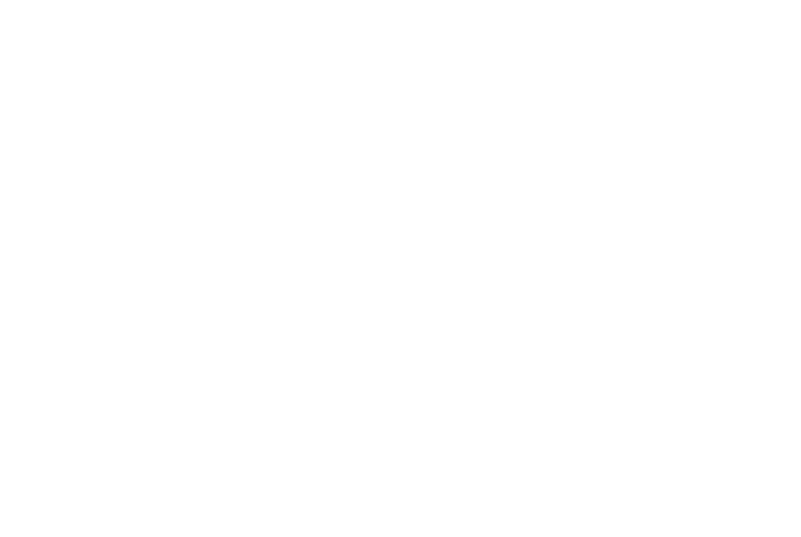

# gomint-branding
Official branding components of the GoMint project. At request more variations can be made. Create an issue and we'll have a little chat!

## Pure

  
Colored

  

  
Black

  

  
White

  

### Wire

  
Colored

  

  
Black

  

  
White

  

### Outlined
#### Circle

  
Black

  

  
White

  

#### Square

  
Black

  

  
White

  

## Text

  
Colored

  

  
Black

  

  
White

  

### Partial

  
Logo colored, Text black

  

  
Logo colored, Text white

  

## Avatar

  
Circle

  

  
Square

  

## Promotional

  
Logo colored, text black, "powered" aligned left

  

  
Logo colored, text black, "powered" aligned right

  

  
Logo colored, text white, "powered" aligned left

  

  
Logo colored, text white, "powered" aligned right

  

